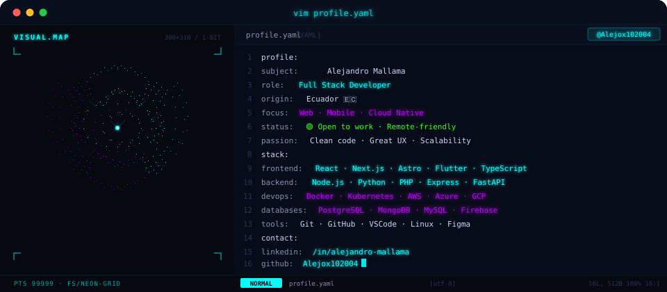

<div align="center">

<!-- NEON CYBERPUNK BANNER -->
<a href="https://github.com/Alejox102004">
  
</a>

<br/>


&nbsp;
<a href="https://linkedin.com/in/alejandro-mallama">
  
</a>
&nbsp;


</div>

---

## `$ whoami`

<p align="center">
  
</p>

<br>

<div align="center">

## `$ cat tech-stack.yaml`

<table border="1" cellpadding="14" bgcolor="#0d0d1a">
  <thead>
    <tr>
      <th colspan="2" align="left"><code>alejandro@mallama:~$ cat tech-stack.yaml</code></th>
    </tr>
  </thead>
  <tbody>
    <tr>
      <td width="50%" valign="top"><code>├─ 🌐 frontend:</code><br><br>
        <br>
        <sub><code>React · Next.js · Astro · TypeScript · Flutter</code></sub>
      </td>
      <td width="50%" valign="top"><code>├─ ⚙ backend:</code><br><br>
        <br>
        <sub><code>Node.js · Python · PHP · Express · FastAPI</code></sub>
      </td>
    </tr>
    <tr>
      <td width="50%" valign="top"><code>├─ 🗄 databases:</code><br><br>
        <br>
        <sub><code>PostgreSQL · MySQL · MongoDB · Firebase</code></sub>
      </td>
      <td width="50%" valign="top"><code>├─ ☁ cloud_devops:</code><br><br>
        <br>
        <sub><code>AWS · Azure · GCP · Docker · Kubernetes</code></sub>
      </td>
    </tr>
    <tr>
      <td width="50%" valign="top"><code>└─ 🛠 tools:</code><br><br>
        <br>
        <sub><code>Git · GitHub · VSCode · Linux · Postman</code></sub>
      </td>
      <td width="50%" valign="top"><code>└─ 📐 design:</code><br><br>
        <br>
        <sub><code>Figma · Tailwind CSS</code></sub>
      </td>
    </tr>
  </tbody>
</table>

</div>

<br>

---

<div align="center">

## `$ git log --stats`


<br/>


</div>

<br>

---

<div align="center">

## `$ ping alejandro`

> *"Any sufficiently advanced technology is indistinguishable from magic."* — Arthur C. Clarke

<br>

<a href="https://linkedin.com/in/alejandro-mallama">
  
</a>
&nbsp;
<a href="https://github.com/AlejandroMallama">
  
</a>

<br/><br/>

```
  ╔══════════════════════════════════════════════╗
  ║   Thanks for visiting! Let's build something ║
  ║   amazing together  🚀  ~/Alejox102004       ║
  ╚══════════════════════════════════════════════╝
```

</div>
